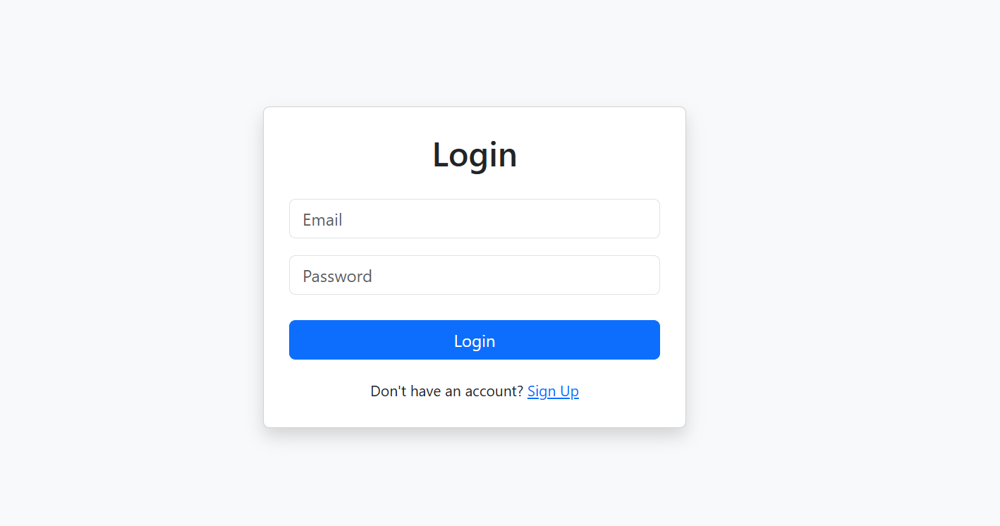
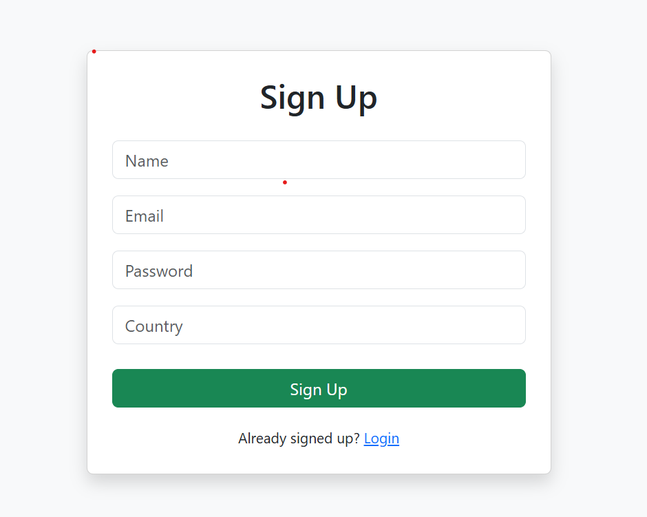
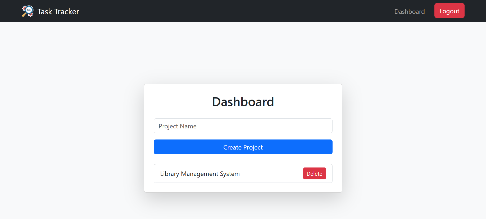
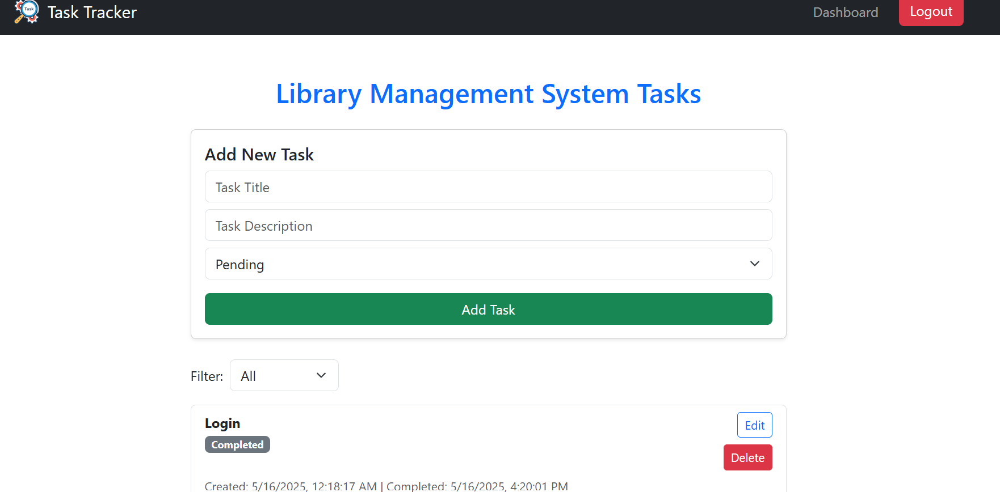
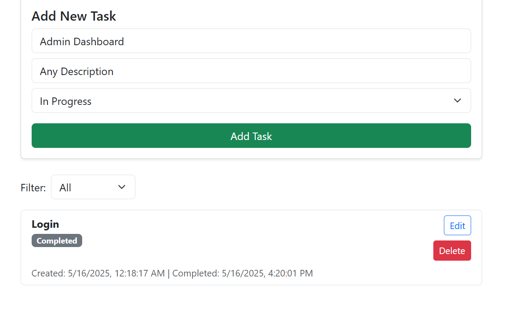
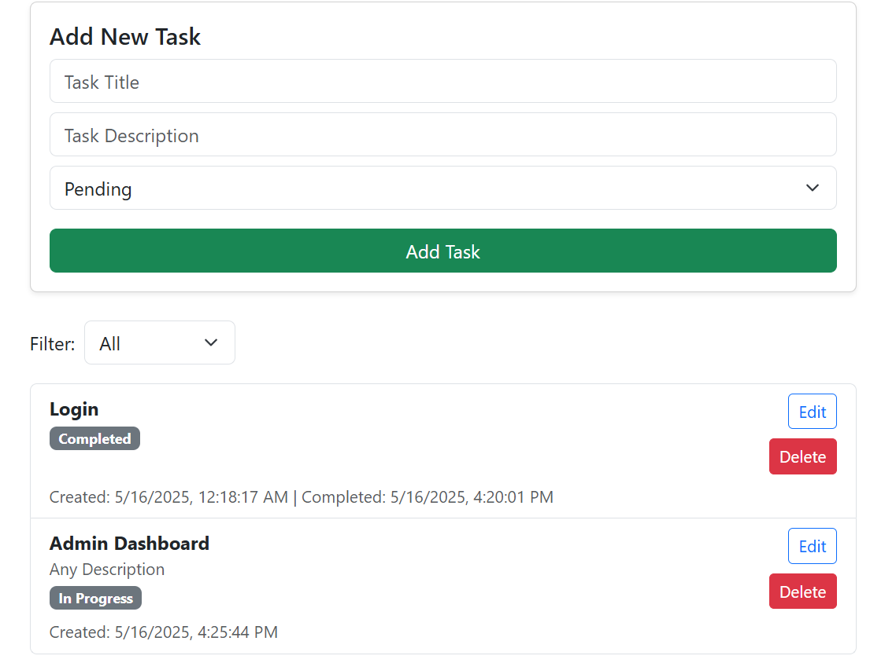
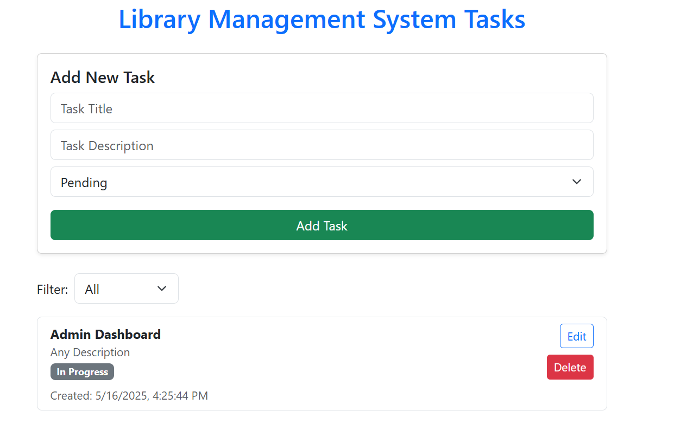
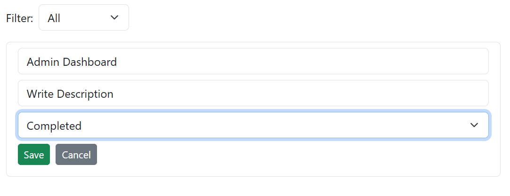
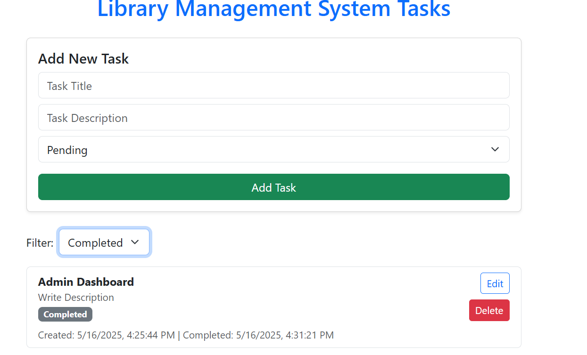

# Task Tracker Application

A full-stack Task Tracker built with **MERN (MongoDB, Express.js, React.js, Node.js)**. This web application allows users to create up to 4 projects and manage tasks within each project. Users can perform CRUD operations on tasks, update task status, and filter tasks based on status. The system includes secure authentication with JWT.

---

## Features

- User Signup & Login with JWT Authentication
- Create up to 4 projects per user (Create Project Button will be disable after user create 4 projects )
- View and delete existing projects
- Create tasks under each project
- Edit task title, description, and status
- Filter tasks by status (All, Pending, In Progress, Completed)
- Display creation and completion timestamps
- Responsive UI using Bootstrap

---

## 🛠️ Technologies Used

- **Frontend:** React.js, Axios, Bootstrap, React Router Dom
- **Backend:** Node.js, Express.js, MongoDB, Mongoose, JWT, bcrypt.js
- **Tool used:** VS Code

---

## Project Structure

task_tracker_application/
- ├── client/ # React frontend code
- ├── server/ # Express backend code
- ├── .gitignore # Root gitignore file
- └── README.md # This file

---

## Getting Started

### Prerequisites

- Node.js installed
- MongoDB installed and running locally

### Installation

1. Clone the repository  
   `git bash`
   - git clone https://github.com/Riya-Jain-here/Task-Tracker-Application.git

# Setup Backend---

`vs code terminal (open your project)`
- cd server
- npm init -y
- npm install mongoose monogodb express ejs body-parser

# Create a .env file with the following variables:

`server/.env`
- MONGO_URI=your_mongo_connection_string
- JWT_SECRET=your_jwt_secret

# Start the server--

- node index.js

# Setup Frontend---

`open new terminal`
- cd client
- npm install
- npm run dev

The frontend will run at http://localhost:5173

# Task_Tracker_Application/screenshots/

- 
- 
- 
- 
- 
- 
- 
- 
- 

